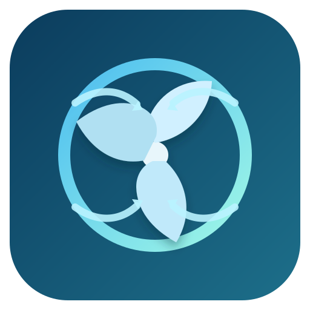

# Smart KWL - Home Assistant Integration

Smart KWL is a highly configurable Home Assistant custom integration that manages ventilation fan speed based on humidity and CO2 demand, with support for away/night/summer behavior and full diagnostics.

## Highlights

- Multi-sensor control for humidity and CO2 with per-sensor thresholds.
- Dedicated Smart KWL manual fan entity with levels 1-8.
- Supports both fan targets and climate targets (fan_mode 1-8).
- Fan levels are discrete and constrained to 1-8 in config flow.
- Threshold wizard to set min/max for every selected humidity and CO2 sensor.
- Detailed regular check log for troubleshooting and dashboard display.

## Requirements

- Home Assistant Core 2024.1.0 or newer.
- HACS installed (recommended installation path).
- A controllable target entity:
  - fan entity that supports percentage, or
  - climate entity that supports fan_mode values 1..8.
- At least one humidity or CO2 sensor.

## Installation

### HACS (recommended)

1. Open HACS -> Integrations -> menu -> Custom repositories.
2. Add repository URL: https://github.com/BigBasti84/ha_smart-kwl
3. Category: Integration.
4. Install Smart KWL.
5. Restart Home Assistant.
6. Go to Settings -> Devices and Services -> Add Integration -> Smart KWL.

### Manual

1. Copy custom_components/smart_kwl into your Home Assistant config/custom_components directory.
2. Restart Home Assistant.
3. Add Smart KWL from Settings -> Devices and Services.

## Configuration Guide

### Core fields

- Target entity (fan or climate):
  - fan.<...>: Smart KWL writes fan percentage.
  - climate.<...>: Smart KWL writes climate fan_mode as levels 1..8.
- Humidity sensors / CO2 sensors:
  - Select one or more sensors.
  - After saving the first form, Smart KWL opens threshold steps for each selected sensor.
- Fan levels:
  - Min fan level, Max fan level, Default fan level are all discrete 1..8.

### Optional fields

- Away binary sensor: when ON, away fan level becomes the base level.
- Away fan level: level used while away is active (1..8).
- Night mode: enables night behavior using start/end window.
- Night max fan level: hard upper limit during night.
- Night summer fan level: target level for summer nights.
- Summer mode binary sensor: toggles summer-night behavior.

### Temperature inputs (optional diagnostics)

These inputs only mirror values into Smart KWL entities for visibility. They do not drive control logic directly.

- Incoming air temperature (outside -> unit): fresh outdoor air entering the ventilation unit.
- Outgoing supply temperature (unit -> rooms): supply air leaving the unit into rooms.
- Exhaust extract temperature (rooms -> unit): extract air returning from rooms to the unit.
- Outside ambient temperature (optional): independent outdoor reference sensor.

## Fan Control Entity

After setup, Smart KWL creates a dedicated fan entity:

- Name: Manual Fan Level
- Type: fan entity with preset levels 1..8
- Purpose: lets you manually set a level directly from the UI

Notes:

- Manual changes are applied immediately.
- Automatic control still runs on the configured interval and may adjust level afterward based on sensor demand and modes.

## Threshold Setup (Humidity and CO2)

For every selected humidity and CO2 sensor, Smart KWL asks for:

- Minimum threshold
- Maximum threshold

This per-sensor threshold wizard allows independent min/max values for each sensor.

## Dashboard Card

A ready card is available at dashboard/smart_kwl_checks_card.yaml.

1. Open your dashboard.
2. Add a Manual card.
3. Paste the YAML from that file.

It shows the latest check runs, sensor evaluations, and final actions.

## Versioning and HACS Updates

- Integration version is defined in custom_components/smart_kwl/manifest.json.
- HACS updates are delivered through GitHub releases/tags.
- Current development release: 0.2.1.

Workflow for next updates:

1. Commit changes.
2. Bump manifest version.
3. Create and push a new tag (for example v0.2.1).
4. HACS will offer the update.

## Troubleshooting

- No threshold pages shown:
  - Ensure at least one humidity or CO2 sensor is selected.
- Cannot control target:
  - Verify selected entity is fan.<...> or climate.<...> with valid fan_mode behavior.
- No check log updates:
  - Wait one check interval and confirm sensors have valid numeric states.

## Support

- Issues: https://github.com/BigBasti84/ha_smart-kwl/issues
